# PhoenixAI Anywhere Console — UI guide

A high-level tour of the Anywhere web console: what it does, who signs in, where each user
goes, and what every page shows.

## 1. What the console does

PhoenixAI Anywhere is the self-hosted console for PhoenixAI (StarRocks enterprise) clusters
managed by the PhoenixAI operator on Kubernetes. It is a **read-only** console: it observes and
reports, and never modifies cluster data.

Its capabilities fall into four areas:

| Area | What you get |
| --- | --- |
| **Insight** | Cluster inventory and health, node/pod topology, CPU / memory / disk monitoring, query insights, audit-log search |
| **License** | Licenses registered on each cluster, effective-license rules, expiry and capacity tracking, license registration |
| **Metering** | CCU usage per cluster and per day, metering periods, and a full auditable record set with downloadable raw records |
| **Support** | Support bundles — a scenario-driven collector that packages manifests, configs, logs, SQL output and diagnostics for support |

Two supporting capabilities appear inside those pages rather than as destinations of their own:
**saved SQL commands** (read-only SELECT/SHOW commands per cluster) and **shell commands**
(saved commands run inside a pod, for example `jstack` or disk usage).

Only shared-data ("elastic") clusters are supported. A shared-nothing ("classic") cluster may
still be listed with its type reported, but feature pages do not operate on it.

## 2. The two kinds of users

The console is two consoles side by side, each with its own sign-in and its own account model.

### Admin Console

The platform operator's view. Covers every cluster the installation can see, plus the
install-level pages (usage, license, health checks, support).

- **Admin accounts live in a Kubernetes Secret**, managed with `kubectl` or Helm at install time.
  Several admin accounts may exist; they are added, removed and rotated by editing that Secret.
- Admins are not database users and need no database credential. For cluster SQL, Anywhere
  resolves the cluster's own root identity from the cluster CR's Secret automatically — no FE
  address or password is ever configurable in the console.
- In this release all admins are equivalent: any successful admin sign-in has full access to
  every admin page.

### Cluster Console

A single cluster's own users. Covers data catalog browsing, query insights and system
monitoring for the one cluster the session is bound to.

- **Accounts are PhoenixAI database users**, defined *inside each individual
  cluster*. Anywhere holds no user store for them — no create, delete or password reset; they
  are managed in the cluster with SQL (`CREATE USER`, `GRANT`, …).
- Sign-in selects a cluster, then takes that cluster's database username and password. Anywhere
  validates them by opening a real connection to the cluster's FE, so a rejected credential is a
  failed sign-in, and an unreachable FE is reported as a distinct error.
- The session is bound to that one cluster and passes the credentials through on every query, so
  **what a user can see is decided entirely by the cluster's own SQL privileges**, not by Anywhere.
- Accounts are per-cluster: the same username in two clusters is two unrelated accounts with
  independent passwords. That is why the sign-in form asks for the cluster first.
- `root` is PhoenixAI's built-in superuser. Any user that can connect to the FE can sign in — but
  `root` is not merely a convenient example: **the Audit logs tab is visible only to `root`**, as
  §5 describes under Query insights.

:::caution Credentials are passed through, so changing a password ends the session
Because every query carries the credentials the session was opened with, changing that user's
password in the cluster invalidates the running session immediately. The next page load reports
`cluster credentials were rejected; please log in again`.

Two things are worth knowing about that state. First, the **Session expired** dialog it raises
says "You will be redirected to sign in again" but does not redirect, and it blocks the page
underneath — including the user menu, so there is no way to sign out from it. Navigating to
`/cluster-console/login` returns you to the same dialog; clearing the session cookie is the way
out. Second, if you change **root's** password, you also break Anywhere's own cluster-usage path,
because Anywhere authenticates as root from the cluster CR's Secret — query-history collection
starts logging `access denied` until the two agree again.

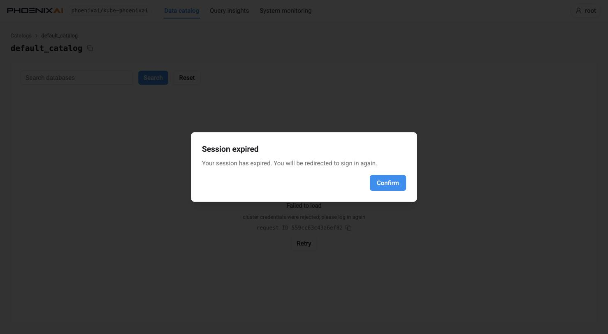
:::

### How the two interact

The two sessions are independent and coexist in one browser: signing into one console never
signs you out of the other, and each keeps its own cookie. They do not share access either —
admin pages are not reachable with a cluster session, and a signed-in cluster user who opens an
admin URL is redirected to the admin sign-in page.

The Cluster Console sign-in shows a hint when a **cluster** session is already active, naming the
identity being replaced. An active *admin* session does not raise that hint — the two are separate
cookies, and this form only probes the cluster one.

## 3. Where each user goes

Both consoles are served by the same installation, on the same host and port, distinguished by
path.

### Admin Console paths

| Page | Path |
| --- | --- |
| Sign in | `/login` |
| Clusters (landing page; `/` redirects here) | `/clusters` — table view at `?layout=table` |
| Cluster detail | `/clusters/{namespace}/{name}` — tabs at `?tab=` |
| Warehouse detail | `/clusters/{namespace}/{name}/warehouses/{warehouse}` |
| Usage & Metering | `/usage` — tabs at `?tab=` |
| License | `/license` |
| Health checks | `/health-checks` |
| Support | `/support` |
| Create support bundle | `/support/create` |

The sidebar carries four destinations — Clusters, Usage & Metering, Health checks, Support — and
can be collapsed to icons. License has no sidebar entry: reach it from a cluster's License tab,
or by URL. Below the destinations sit a **Help document** link and the signed-in user's menu,
which holds a **Theme** selector (Light / Dark / System), **Sign out**, and the running version.

### Cluster Console paths

| Page | Path |
| --- | --- |
| Sign in | `/cluster-console/login` |
| Data catalog | `/cluster-console/catalog` |
| Databases in a catalog | `/cluster-console/catalog/{catalog}` |
| Database detail | `/cluster-console/catalog/{catalog}/{database}` — tabs at `?view=`, job kind at `?task=` |
| Table detail | `/cluster-console/catalog/{catalog}/{database}/tables/{table}` — tabs at `?tab=` |
| Query insights | `/cluster-console/query-insights` — audit sub-tab at `?view=audit` |
| Query detail | `/cluster-console/query-insights/{queryId}` |
| System monitoring | `/cluster-console/monitoring` |

Cluster Console URLs never name the cluster — the session supplies it. That is why the paths are
the same for every cluster, and why switching clusters means signing in again. The signed-in
cluster is shown in the header (`phoenixai/kube-anywhere` in the screenshots below), beside the
three destinations and the user menu.

Pages that render times take a display timezone from the UI and put it in the URL (`?tz=UTC`), so
a link reproduces what the sender was looking at.

**Finding the other console.** Both paths render the same sign-in page, which carries two tabs —
**Platform administrator** and **Database user** — so neither audience has to be told a URL: the
path you arrive on simply preselects its tab. There is also a hand-off from a cluster's detail
page in the Admin Console (**Open cluster**), which opens that page on the **Database user** tab
with the cluster preselected; that is context only, credentials are still required.

The cluster picker is preselected from `?cluster=ns/name` (the admin hand-off, or a bounce
carrying an expired session's cluster) or, failing that, from the last cluster signed into from
that browser. It is not preselected just because the installation has only one cluster.

## 4. Admin Console pages

> **What a brand-new environment looks like.** Several pages are empty until time passes or a
> setting is turned on, and that is normal rather than broken:
> **Usage & Metering** reads all zeros (`Clusters tracked 0`, `Last metered at —`) because usage is
> sampled on an interval; the cluster **Overview** shows `—` for month-to-date CCU and "No data for
> this metric" for data volume, because that comparison needs a 24-hour baseline the cluster is
> too young to have; **Support** has no bundles until someone creates one; and **Query insights**
> is switched off by default — see that section for the two settings it needs.

### Sign in — `/login`

Username and password against the admin Secret, beside a product hero panel. A session-expiry
notice appears here when an earlier session timed out, and sign-in returns you to the page you
were trying to reach (carried as `?redirect=`). A theme toggle sits in the top-right corner.

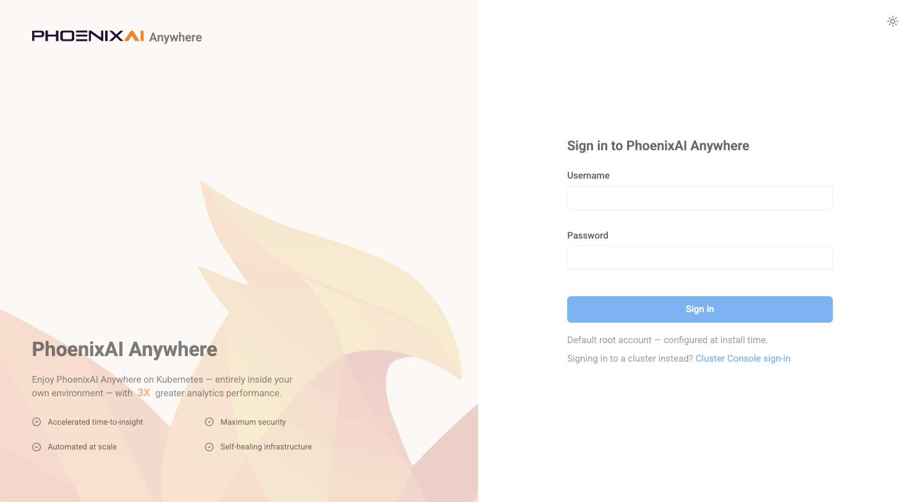

### Clusters — `/clusters`

The landing page: every cluster the installation can see, in **card view** or **table view**
(`?layout=table`). Both show name, status (Running / Creating / Stopped / Failed / Unknown), type,
version, coordinator address, warehouse count, namespace, creation time and license expiry — with
a near-expiry license highlighted. Selecting a cluster opens its detail page.

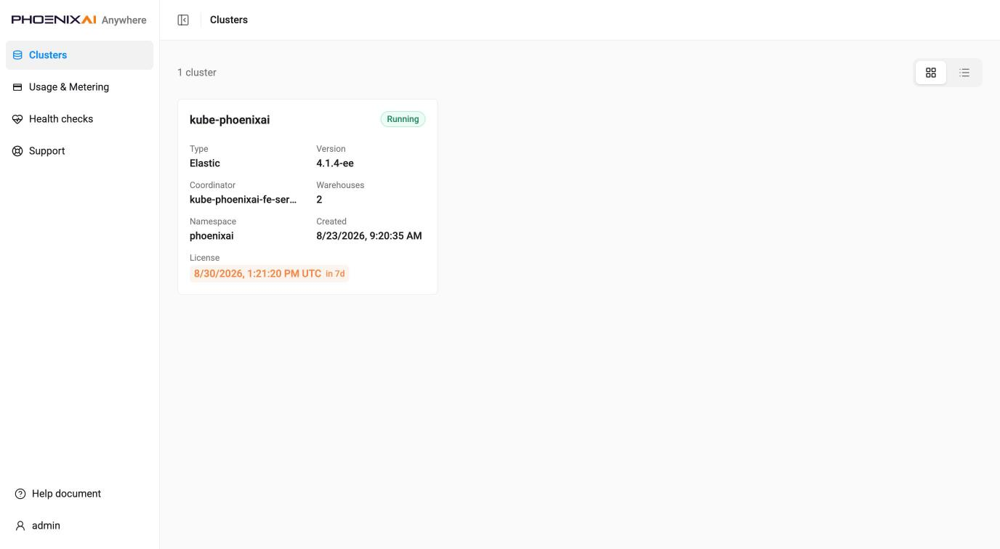

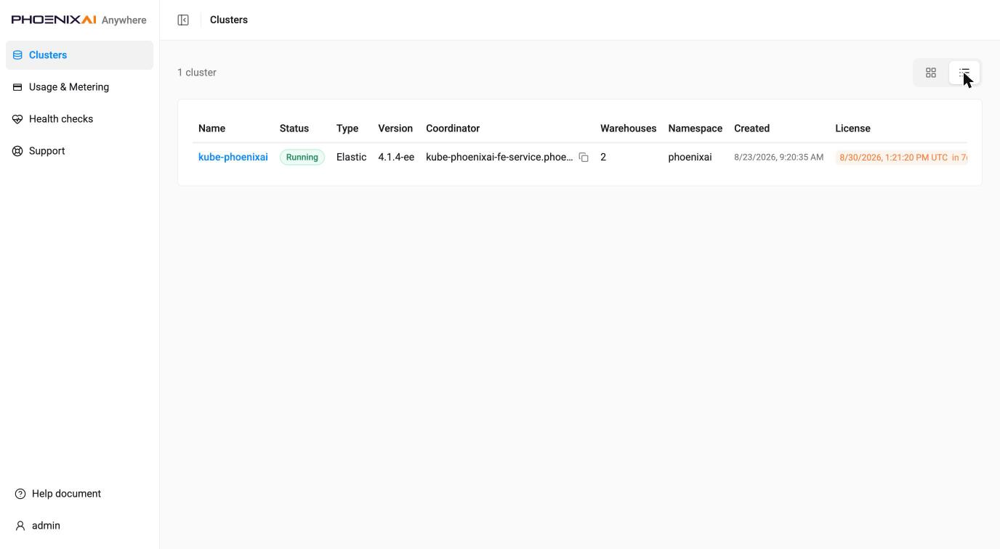

### Cluster detail — `/clusters/{ns}/{name}`

One cluster, as seven tabs addressed by `?tab=` so links stay shallow (`overview` is the default
and carries no parameter). **Open cluster** in the top-right hands off to the Cluster Console for
this cluster.

**Overview** — cluster properties (name, namespace, type, version, status, warehouses,
created, license expiry, time zone), month-to-date CCU, node and warehouse activity, data-volume
change over 24 hours, and a 7-day cluster usage trend, annotated **All times in UTC**.

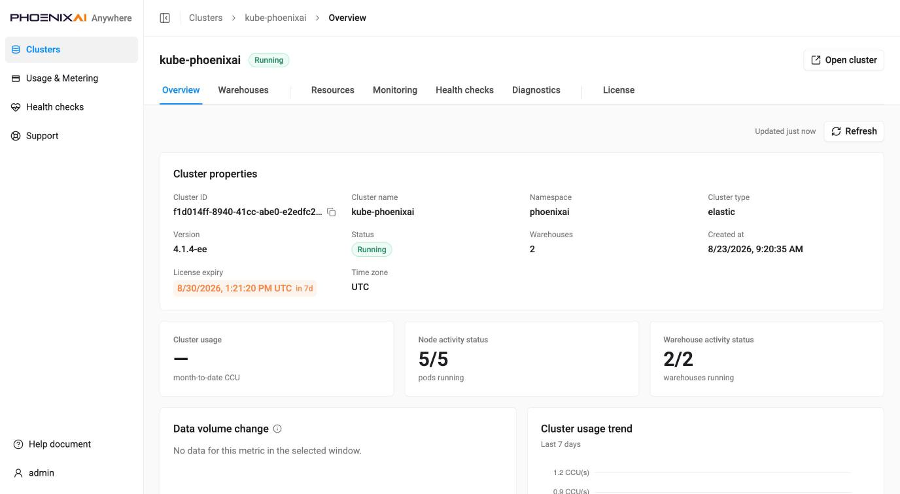

**Warehouses** — one card per warehouse including the built-in one, badged **Builtin warehouse**
or **Normal warehouse**, with requests and limits, replicas, autoscaling range, creation time,
pods running/total and utilization.

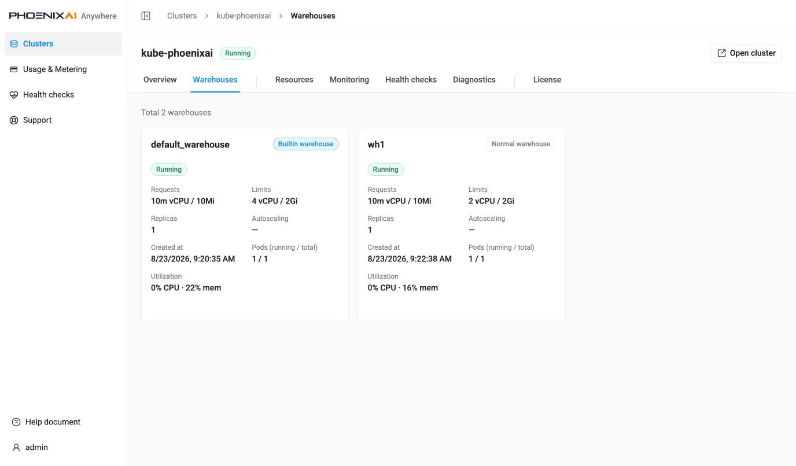

**Resources** (breadcrumb: Resources & Topology) — a health strip (nodes ready, warehouse count,
"All components healthy"), then the cluster object itself and expandable groups: Coordinator
(shared across all warehouses) and Warehouses, each warehouse running its own compute nodes, with
each group naming its image and its requests and limits. Each row's **View** shows its manifest
and recent Kubernetes events; pods carry live CPU and memory against requests.

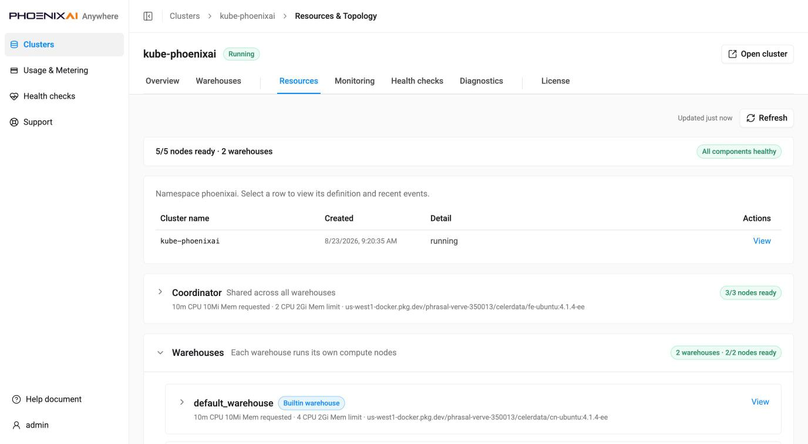

**Monitoring** — charts over a selectable time range and display timezone, split between
**Cluster state** and **Instance state**, with a one- or two-charts-per-row layout that can be
reordered, and a per-chart aggregation selector. The display timezone defaults to **UTC+00:00**.
Which charts appear, and which aggregation each defaults to, depends on what the cluster's
PhoenixAI version exposes — treat any specific set as an example rather than a fixed list; here it
is Cluster Data Size, Query QPS, Ingested Times and Ingested Rows.

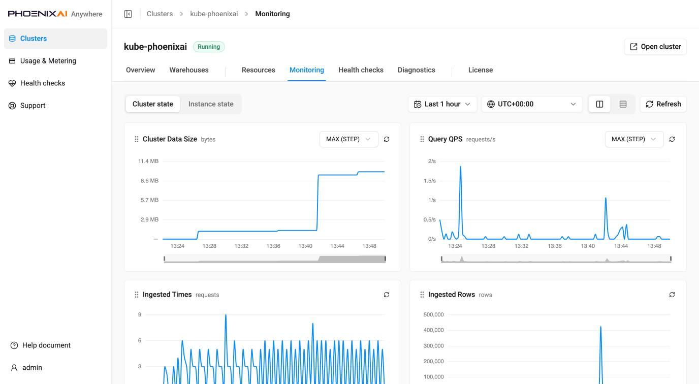

**Health checks** — this cluster's checks by type (info / warning / critical), status, component
and message, each naming the check that produced it, with sortable columns, filters and
pagination. A real cluster produces a substantial list — a couple of dozen findings on a newly
built cluster — and they are specific and actionable rather than generic: an expiring license,
CPU limits set on latency-sensitive components, multi-replica components not spread across
topology domains.

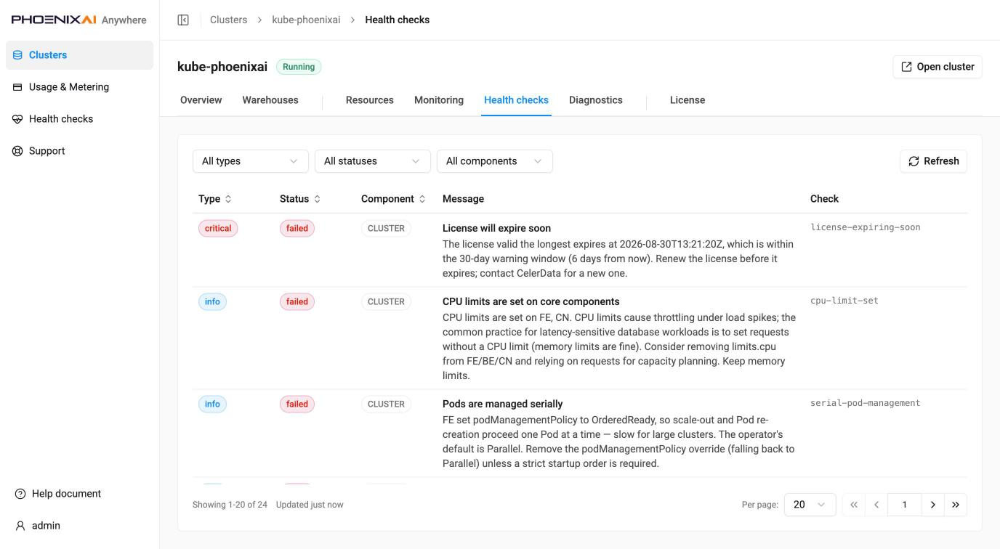

**Diagnostics** — two collapsed libraries, each reporting how many entries it holds (16 SQL
commands and 1 shell command here). **SQL commands** runs saved read-only commands for this
cluster; **Shell commands** runs a saved shell command inside one pod. Expanding a library reveals
its picker, **Run**, and **New command**; results report exit code, stdout and stderr. Creating
custom shell commands is gated by configuration and can be disabled entirely.

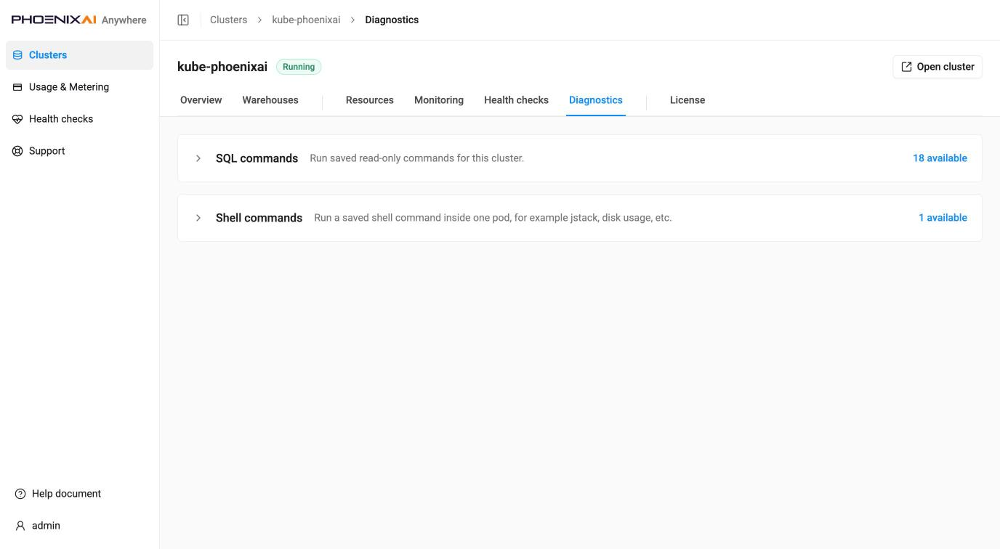

**License** — the effective license for this cluster: what it is bound to, expiry with days
remaining, capacity used against licensed cores, **Register license**, and the registered-licenses
table marking which one is effective. Times are UTC.

A newly created cluster already carries a license — nobody registers one by hand — but it is
short-lived, so a fresh environment shows **Expiring soon** and Health checks raises
`license-invalid` as critical (until 2026-08-24 this rule was `license-expiring-soon`, before it
merged with `license-missing`). That is expected on a new cluster, not a misconfiguration.

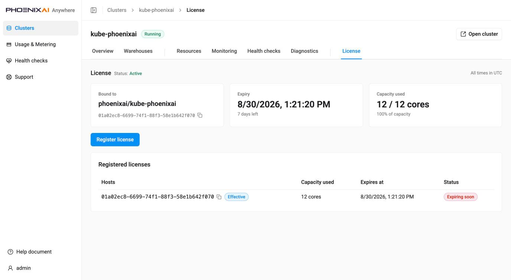

### Warehouse detail — `/clusters/{ns}/{name}/warehouses/{warehouse}`

A warehouse as its own page rather than a dialog, so it is deep-linkable, with its own Overview,
Resources and Health checks tabs. Overview carries requests and limits, replicas, autoscaling,
created, cluster, version, pods, utilization and image.

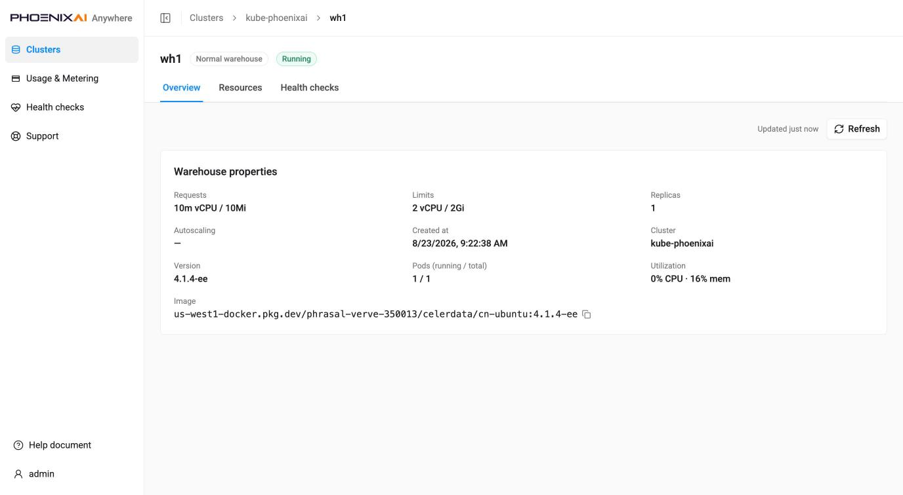

### Usage & Metering — `/usage`

Install-level metering across all clusters, in three tabs. **All times are UTC.** Clusters running a
PhoenixAI version that does not expose the usage metric are called out as *not metered*, with
the required version stated, rather than shown as zero.

**Overview** — this month's CCU, clusters tracked, collector status, last metered at, and the
metering periods table with the CCU formula in force (`CCU = 0.9 x coreSeconds/3600/4 (v1)`).

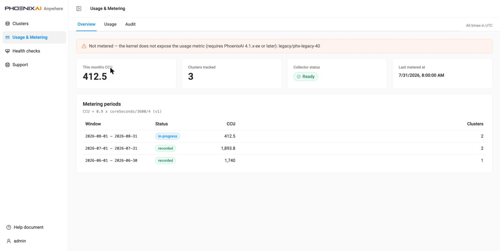

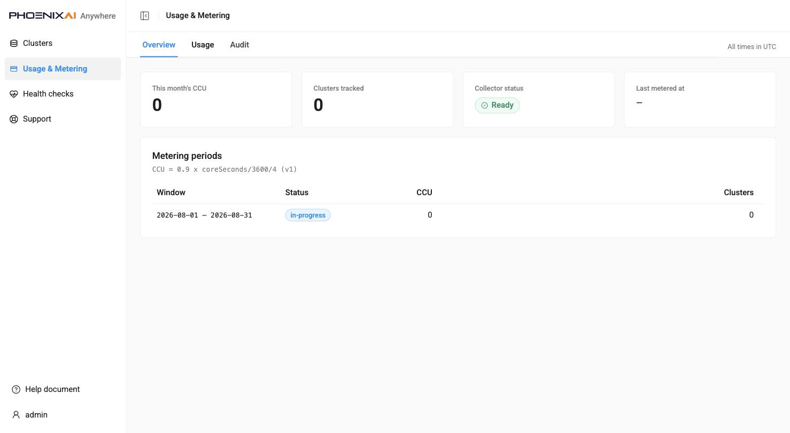

**Usage** — the cluster usage graph per day, filterable to one cluster or all, over 1M / 3M / 6M
/ YTD / 1Y / MAX, switchable between Graph and Details.

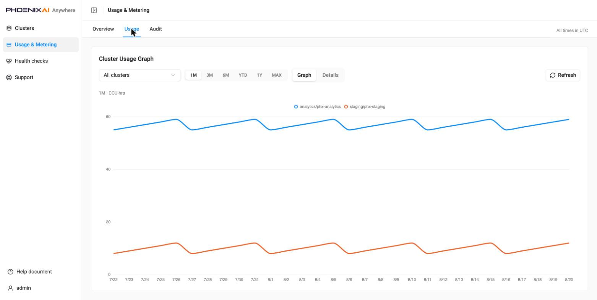

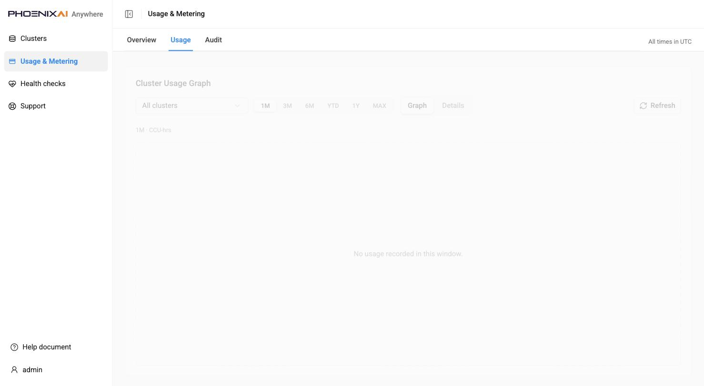

**Audit** — the complete record set behind those numbers: record count, sampling interval, how
CCU is derived, per-cluster first/last record and sequence range, counter resets explained, and
**Download JSON** of every raw record with sequence numbers and hashes for verification.

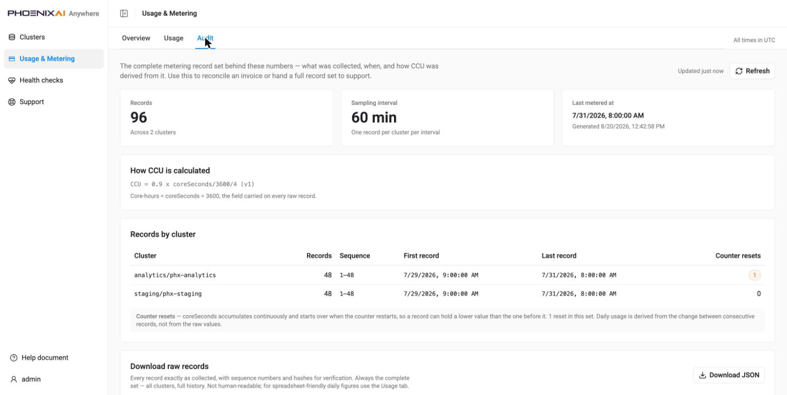

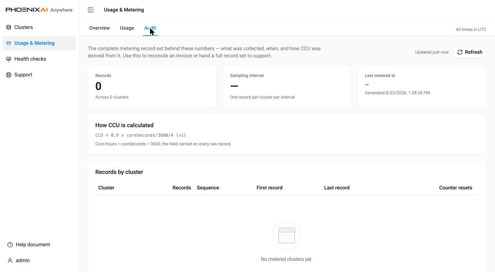

### License — `/license`

The install-level license page, with a cluster selector in the header (licenses are
cluster-scoped) and **Register license**. Shows what the license is bound to, expiry with days
remaining, and capacity used. Times are UTC.

:::caution License history does not load in this release
The **License history** panel — activation, renewal and alert events — is served by an endpoint
the backend has not built yet (`/api/v1/license/events`, still marked a proposal in the
frontend's endpoint map). Against a real installation the request falls through to the SPA and the
panel reports `Failed to load … is not valid JSON`. The three summary cards above it are real.

Per-cluster license facts, including the registered-licenses table, are on the cluster's own
License tab and do work.
:::

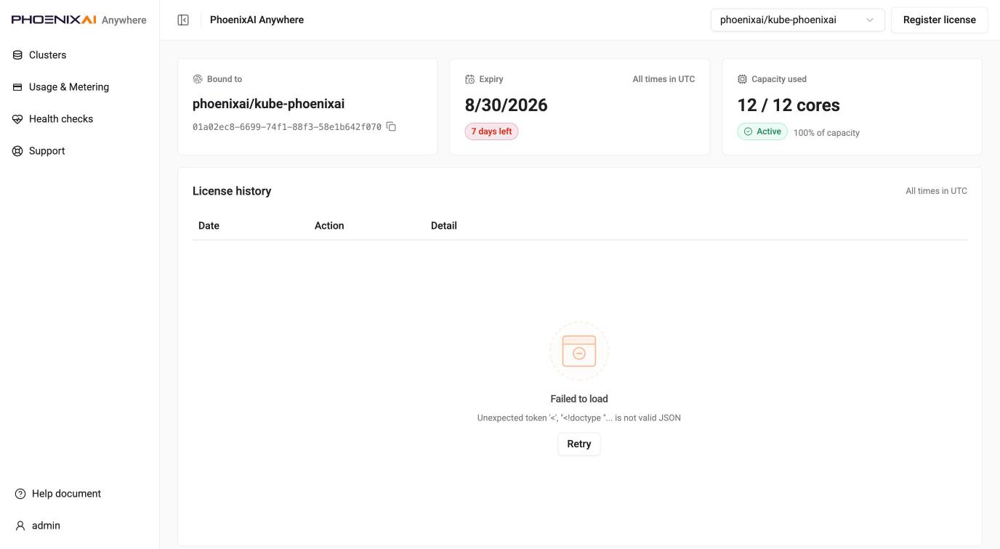

### Health checks — `/health-checks`

Every check across all clusters in one table — cluster, type, status, component, message and
check id — filterable by cluster, type, status and component, with sortable columns and
pagination. Findings are ordered by severity, then component, then rule id.

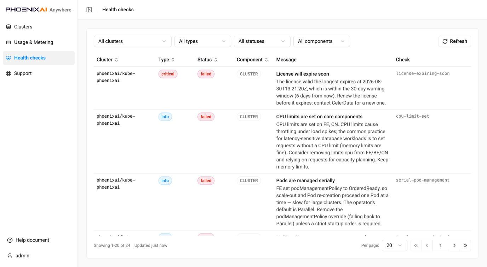

### Support — `/support`

Support bundles for the selected cluster: bundle name, cluster, created, size, status and the
categories collected. Finished bundles download from the name; the row actions view details, copy
an export link, and delete. An **Interrupted** bundle (Anywhere restarted mid-run) offers resume
instead. Sensitive values are excluded from bundles.

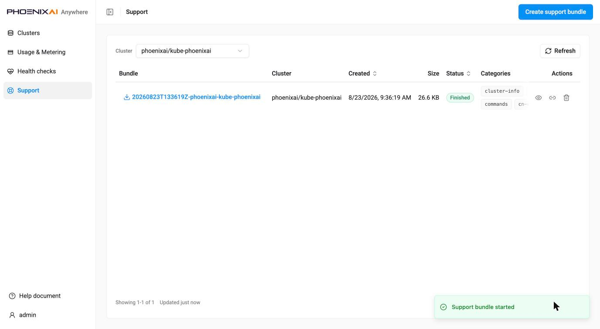

### Create support bundle — `/support/create`

A full-page composer, which collapses the sidebar to icons. The **Scenarios** rail on the left
("pick what you're seeing and we'll tick the artifacts support usually needs") preselects a set —
compute node crash, query trace, heavy or failing SQL, coordinator stall — or *Something else* to
choose freely; each names how many artifacts it selects. On the right, **What to collect** lists
every artifact with what it is for, its collector id (`cluster-info`, `config`, `logs`,
`commands`, `jstack`, `pstack`, `jvm-profile`, `audit-analysis`, `cn-crash-context`,
`metrics-snapshot`, `cn-memory`), a shared time window, and per-artifact parameters. Log
collection can take whole files or only lines matching a search — the choice that decides whether
hundreds of megabytes or tens are transferred. The page warns when a selection is incomplete and
an artifact would be silently skipped.

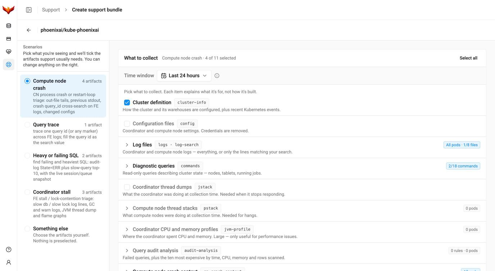

The footer carries an estimate — size and time to collect and download, with **Recalculate** — and
one primary action, **Create bundle**. A large bundle asks for confirmation first.

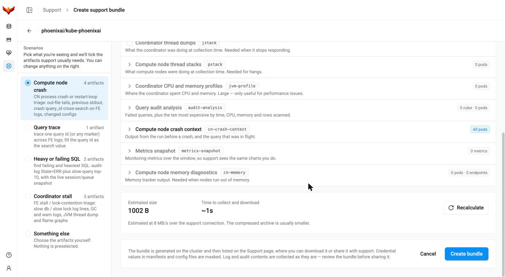

### Not found — `/404`

A full-bleed error page with a link home. Unknown URLs resolve here without a session, so a typo
or stale link never shows a sign-in page.

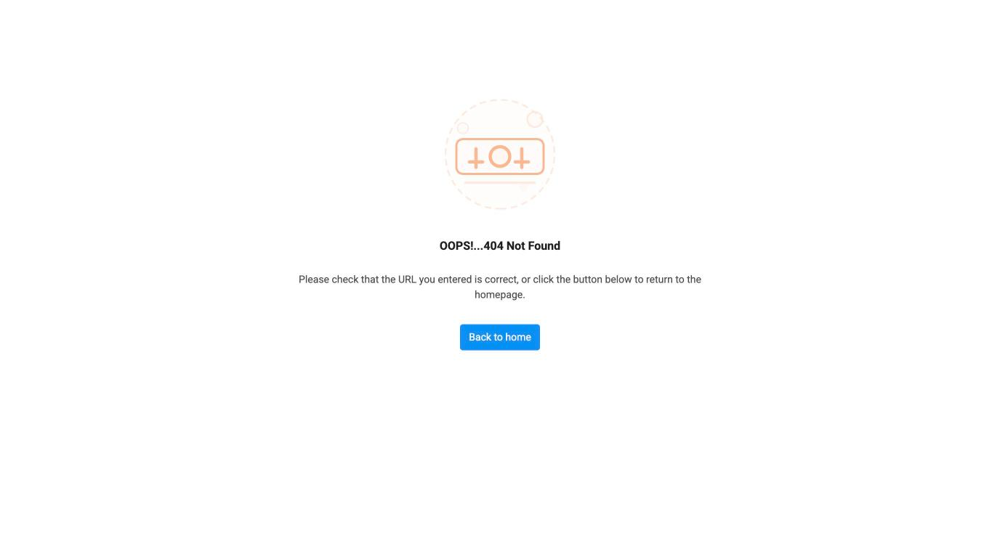

## 5. Cluster Console pages

### Sign in — `/cluster-console/login`

The **Database user** tab of the shared sign-in page. Select the cluster from the list, then
enter that cluster's database username and password. The two credential fields are labelled simply
**Username** and **Password** — the same as the administrator tab, because both tabs ask for the
same kinds of thing. The form notes that cluster credentials come from your platform admin.
Reaching the administrator sign-in is a tab away, and the brand hero panel is shared by both.

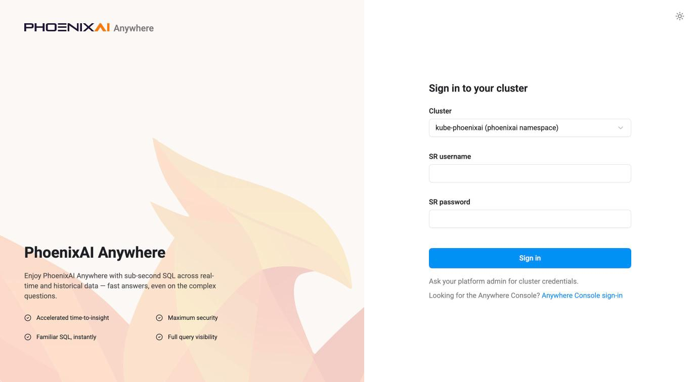

### Data catalog — `/cluster-console/catalog`

Read-only browsing of the signed-in cluster, drilling down through searchable levels.

**Catalogs** — every catalog with its type and comment. A cluster with no external catalogs
configured shows only `default_catalog`, typed **Internal**; external catalogs such as Hive appear
here as they are added.

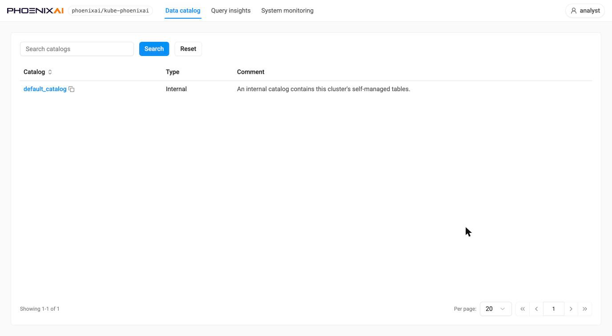

**Databases** — the databases in a catalog, with table count and size.

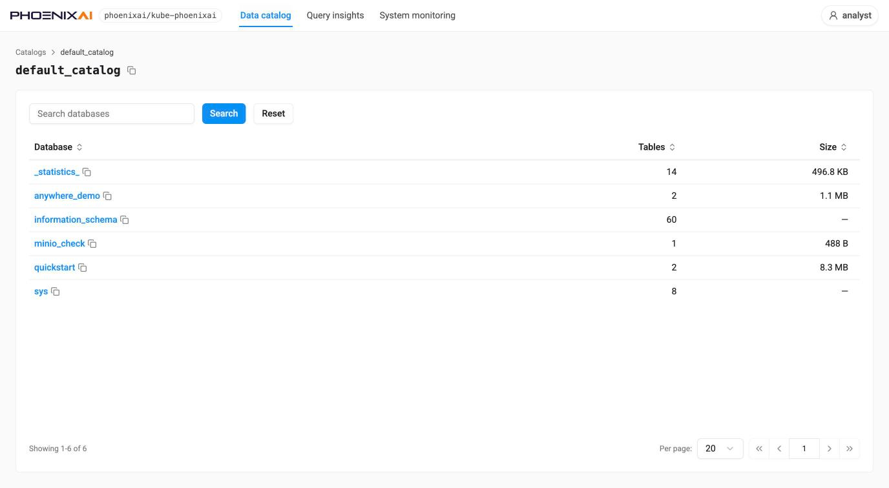

**Database detail** — tabs for **Tables**, **Materialized views**, **Views** and **Tasks**
(`?view=`). The Tables tab lists rows, size, creation time, and the table model under a column
headed **Remark** (`OLAP` for an ordinary table) rather than a free-text description.

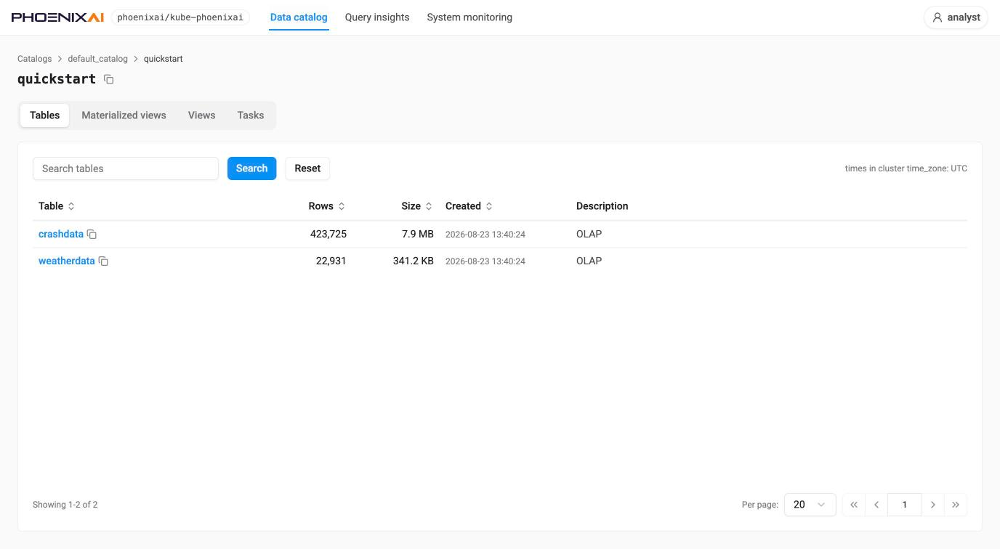

**Tasks** groups jobs by kind in a left-hand rail — Kafka Import, Other Import, Export, Schema
Change, Creating View (`?task=`) — and **the columns differ by kind**: an import job carries its
identifying **Tag**, state, table, created, paused, task count, progress and the reason a stage
changed, and is searchable by job name; a schema-change job carries table, status, progress, start
and end time, timeout and details, and is searchable by table. A kind with nothing to show reports
"No tasks reported."

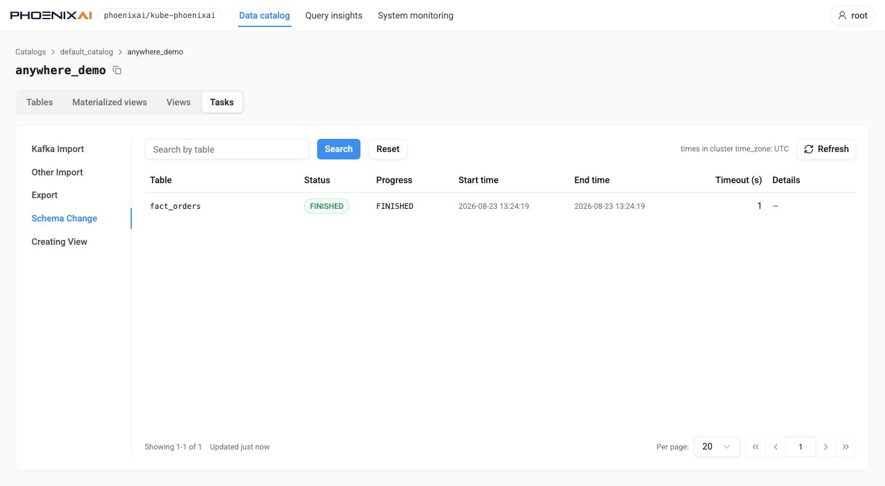

**Table detail** — tabs for **Columns** (type, nullability, key, default, extra, comment), **DDL**
and **Partitions** (`?tab=`).

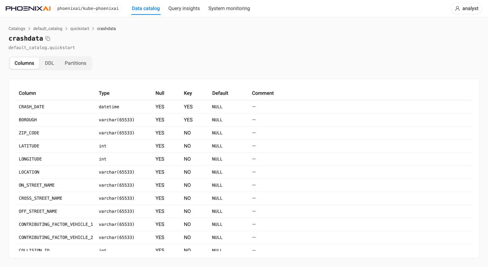

Partitions lists state, visible version, partition key, range, bucket column, buckets, duplications
and size, one row per partition. In shared-data mode the **Duplications** column reads `0` —
replication is the object store's job, not the cluster's — and an unpartitioned table shows a
single row named after the table.

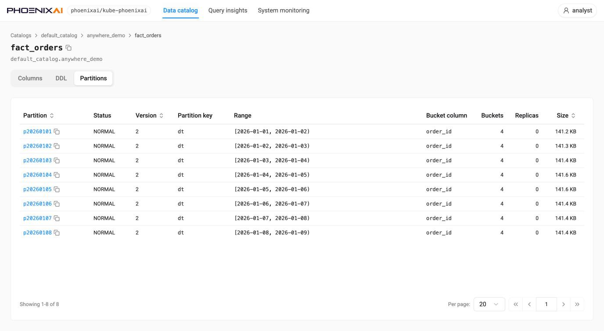

### Query insights — `/cluster-console/query-insights`

Query records with filters: status, time range (**Last 3 hours** by default) and display timezone,
user, duration bounds, and free-text search over SQL or query ID, plus a **Columns** control.
Columns follow the familiar query-history vocabulary — start time, query ID, status, SQL,
warehouse, duration, memory, client IP, query user, source, queue time, CPU cost, scanned bytes
and rows. The list pages by scrolling and reports when it reaches the end.

Records are scoped by the signed-in user's own SQL privileges, so `root` sees the cluster's
internal statistics queries and other users' work, while an ordinary user sees only what it is
entitled to.

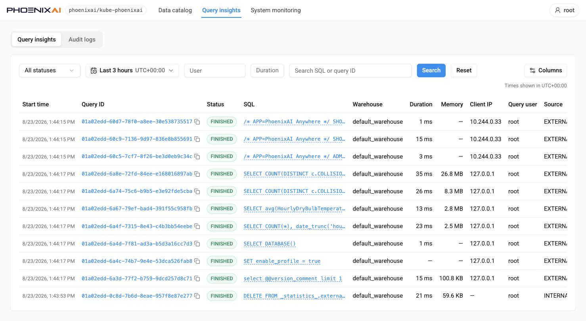

:::note Audit logs is visible only to `root`
**Audit logs** is a sibling sub-tab of Query insights (`?view=audit`), but it is rendered **only
when the signed-in cluster user is `root`**. Any other user — however privileged in SQL — sees
Query insights with no sub-tabs at all and no indication that the tab exists.

That matters on a default install: nothing sets a root password, so Anywhere authenticates as
root with an empty one. Reaching Audit logs means being able to sign in as `root` at this form,
and giving root a password to do so is what breaks Anywhere's own root access (see
[the caution in §2](#cluster-console)).

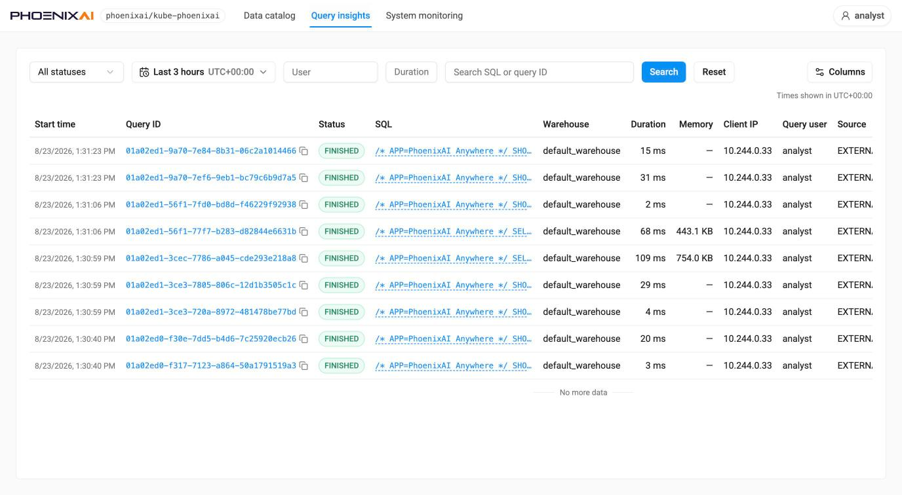
:::

The page has two distinct empty states, and each names its own remedy:

- **Query collection is off on this cluster.** This is the default, so it is what a new
  installation sees. Two settings in two different places must be enabled — `queryHistory.enabled`
  in the Helm values, *and* the FE configuration `enable_collect_query_detail_info` on every FE.
  The banner names both.
- **Collection is on, but not every query is kept.** The page then states the policy in force —
  for example "showing slow queries ≥ 5000 ms and failed queries only" — instead of appearing
  empty for no reason. A separate banner flags when query *profiles* are switched off on the
  cluster, and what to set to enable them; that banner can be dismissed for the visit.

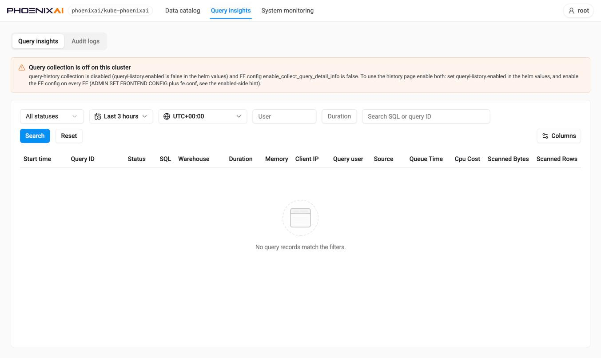

The time-range control offers quick ranges from the last 5 minutes to the last 14 days, plus a
custom range with a calendar and from/to times. Changes take effect when **Search** is pressed,
and an absolute range keeps the instants it was given when the display timezone changes.

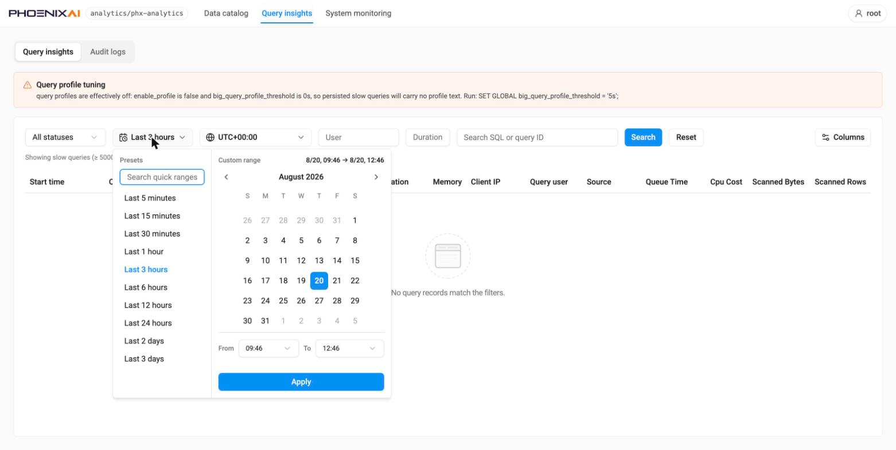

**Audit logs** — pick an FE node and a time window, optionally a keyword or query ID, then search.
Results show start time, query ID, state, cost, user, client address and statement. Statements are
recorded as the FE saw them, with credentials masked.

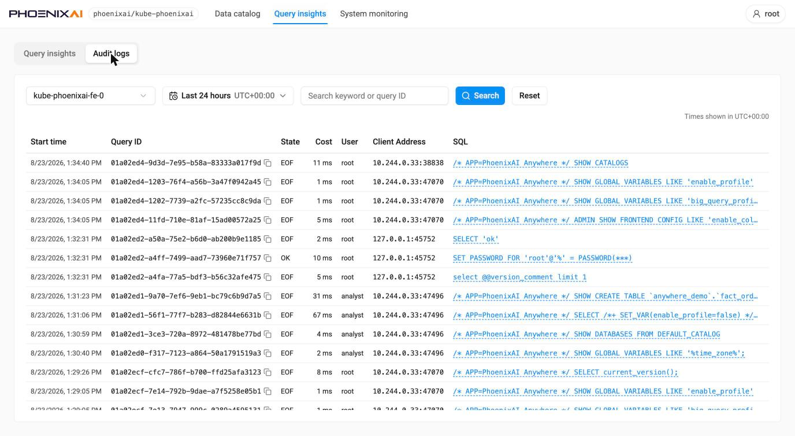

### Query detail — `/cluster-console/query-insights/{queryId}`

One query record, as **Query overview** and **Query profile**. Overview carries the summary
(user, database, catalog, warehouse, FE, client IP, timings, queue time, CPU cost, memory,
scanned rows and bytes, digest, source), the full SQL with a **Format** action, and an **Explain**
section.

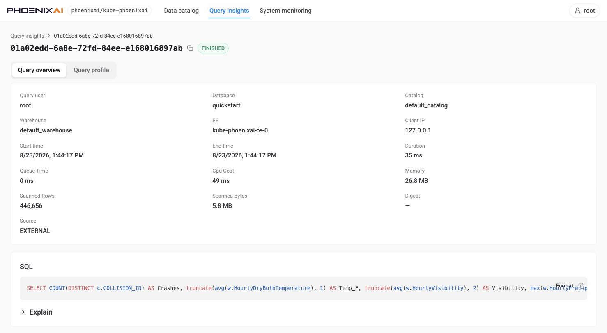

**Query profile** is the cluster's own profile text — summary, planner timings and the operator
tree — in a scrollable reader with a copy action. It is present only for queries the cluster
profiled, and where it is absent the tab says so on the record itself, naming the query's latency
and the `big_query_profile_threshold` that excluded it. A tutorial-sized query finishing in
milliseconds is well under the default 30s threshold, so "not profiled" is the ordinary answer
there rather than a sign that anything is wrong.

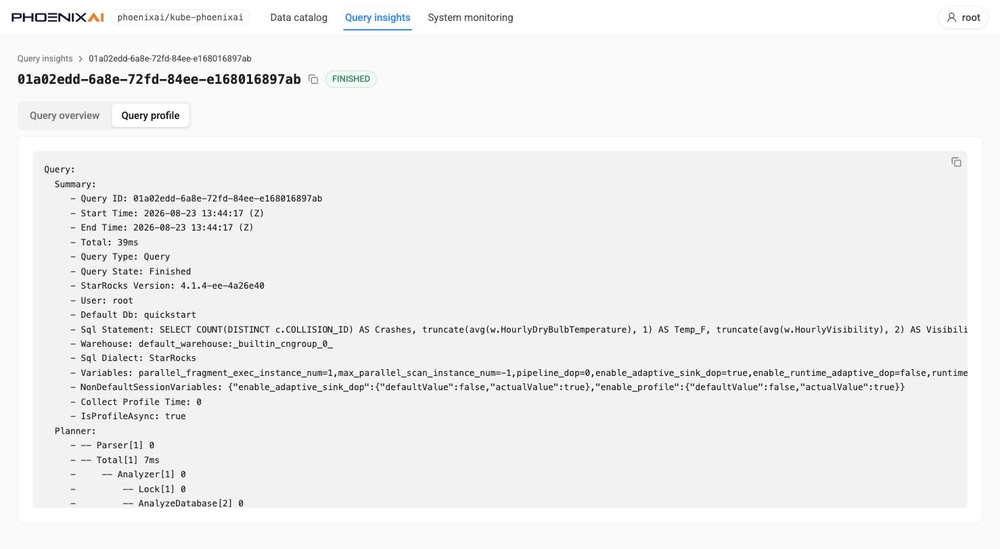

### System monitoring — `/cluster-console/monitoring`

Readings for the cluster, over a selectable range and display timezone (UTC+00:00 by default),
with a note stating the window the "current" figures cover.

**Cluster state** — active and queued query counts, plus cluster-wide charts (Cluster Data Size,
Query QPS, Ingested Times, Ingested Rows). A metric the cluster does not expose says so in place
of the number — query queue metrics, for instance, report as unavailable rather than as zero.

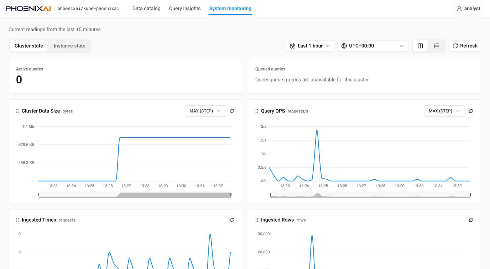

**Instance state** — a node tree (coordinator nodes, and compute nodes grouped by warehouse) that
scopes the charts to the selected instances, each node listed with its address and pod name.
Charts here cover FE JVM heap used and utilization and, when the Prometheus behind Anywhere also
scrapes kubelet/cAdvisor, pod CPU and memory utilization. **Charts** and **Latest values** are
switchable views of the same series.

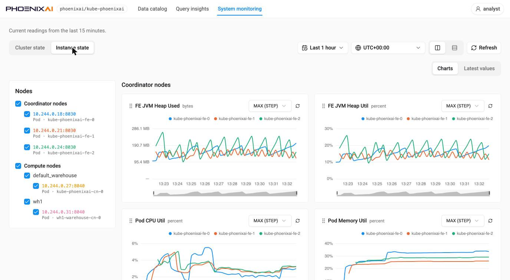

## 6. Conventions worth knowing

- **Time zones.** Usage & Metering and License render in UTC and say so. Every other page renders
  in browser-local time with no zone label. Values the cluster itself formatted are shown
  verbatim and annotated with the cluster's own time zone (for example "times in cluster
  time_zone: UTC" above the catalog tables), because they carry no zone of their own. Monitoring
  and Query insights offer a display-timezone selector, which affects display only and defaults to
  UTC; charts state the zone they are drawn in.
- **Themes.** Both consoles carry a Light / Dark / System selector — in the user menu once signed
  in, and as an icon on each sign-in page.
- **Read-only.** Nothing in the console modifies cluster data. Only catalog-listed SQL is ever
  executed, and execution requests name a saved command rather than carrying SQL.
- **Custom shell commands** are gated by configuration. When disabled, built-in read-only
  commands remain available and the console says custom presets are off.
- **Anywhere's own queries are visible.** Anywhere tags every statement it runs with
  `/* APP=PhoenixAI Anywhere */`. With `queryHistory.slowQueryMs` at its default those short
  queries are never persisted, but set it to `0` to keep everything and the console's own polling
  appears in Query insights alongside user queries.

## 7. Known gaps in this release

| What | Where | Detail |
| --- | --- | --- |
| License history never loads | `/license` | Backed by an unbuilt endpoint; the panel shows a JSON parse error |
| Audit logs hidden from non-root users | `/cluster-console/query-insights` | Gated on the username being exactly `root`, with no hint for anyone else |
| **Session expired** dialog is a dead end after a credential rejection | Cluster Console | When the signed-in user's password changed in the cluster, the dialog says it will redirect, does not, and blocks the page under it; only clearing the session cookie escapes. A plain session *expiry* redirects normally |
